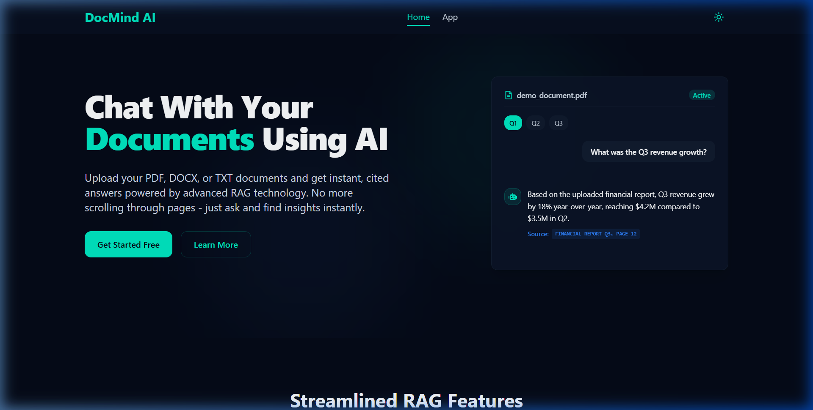
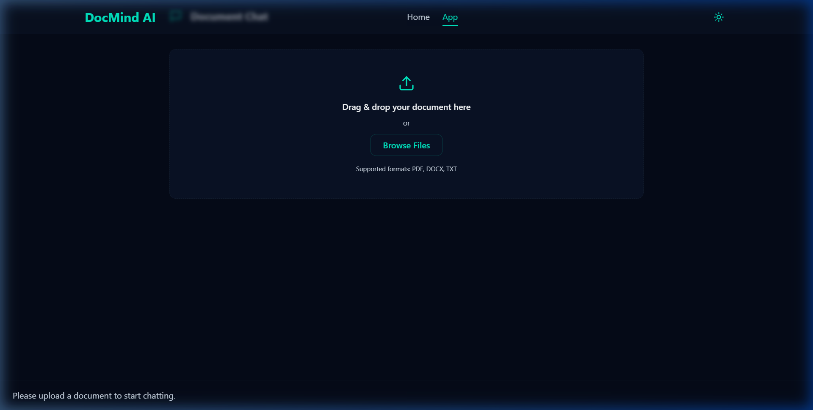

# DocMind AI - Intelligent Document Assistant 📄⚡

[](https://dashboard.render.com)
[](https://fastapi.tiangolo.com)
[](https://react.dev)
[](https://vitejs.dev)
[](https://build.nvidia.com)
[](https://www.trychroma.com)
[](https://tailwindcss.com)
[](https://opensource.org/licenses/MIT)

**DocMind AI** is an advanced, full-stack AI-powered document intelligence assistant. It empowers users to upload documents (PDF, DOCX, TXT) and chat with them using natural language. All answers are grounded directly in the document context using Retrieval-Augmented Generation (RAG) with source citations.

---

## 📸 Interface Preview

<div align="center">
  
</div>

<br/>

| Document Chat & Citations | Ingestion & Upload Zone |
| :---: | :---: |
|  |  |

---

## 🌟 Key Features

- 📑 **Multi-Format Document Ingestion**: Upload `.pdf`, `.docx`, and `.txt` files with automatic text extraction.
- 💬 **Grounded Natural Language Chat**: Ask complex queries and receive accurate, context-aware answers.
- 🔍 **Source Citations**: Every response references specific pages and sections of the uploaded document.
- 🚀 **Dual AI Inference Support**:
  - **NVIDIA NIM Acceleration**: Ultra-fast LLM inference via `langchain-nvidia-ai-endpoints`.
  - **Groq Cloud Fallback**: High-speed fallback via `langchain-groq`.
- ⚡ **Local Semantic Embeddings**: Powered by HuggingFace MiniLM (`sentence-transformers/all-MiniLM-L6-v2`) and ChromaDB vector search.
- 🎨 **Modern Glassmorphic UI**: Sleek dark fintech theme, responsive design, smooth Framer Motion animations, and light/dark mode toggling.
- ☁️ **1-Click Cloud Deployment**: Pre-configured Render Blueprint (`render.yaml`) and Docker Compose setup for zero-friction hosting.

---

## 🏗️ System Architecture

```
┌─────────────────────────────────────────────────────────┐
│               React + Vite Frontend (Port 5173)         │
│         Modern Glassmorphic UI with Framer Motion       │
└────────────────────────────┬────────────────────────────┘
                             │  REST API / CORS
                             ▼
┌─────────────────────────────────────────────────────────┐
│           FastAPI RAG AI Engine (Port 8000)             │
│   ├── Document Processor (PyPDF, Docx2txt, TextLoader)  │
│   ├── Recursive Character Text Splitter (1000 / 150)    │
│   ├── HuggingFace Sentence-Transformers (MiniLM-L6)     │
│   └── ChromaDB Vector Store & Semantic Retriever        │
└────────────────────────────┬────────────────────────────┘
                             │
                             ▼
┌─────────────────────────────────────────────────────────┐
│        NVIDIA NIM Accelerated Inference / Groq LLM      │
│     OpenAI GPT-OSS-20B / Llama 3 / Nemotron Models      │
└─────────────────────────────────────────────────────────┘
```

---

## 🛠️ Tech Stack

### Frontend
- **Framework**: React 18 with Vite
- **Styling**: Tailwind CSS & Glassmorphism design tokens
- **Animations**: Framer Motion
- **Icons**: Lucide React & React Icons
- **Networking**: Axios

### AI Engine & Backend
- **Framework**: FastAPI (Python 3.11+) & Uvicorn
- **RAG Orchestration**: LangChain & LangChain Community
- **LLM Integrations**: `langchain-nvidia-ai-endpoints` & `langchain-groq`
- **Vector Database**: ChromaDB
- **Embeddings**: HuggingFace `sentence-transformers/all-MiniLM-L6-v2`
- **Document Loaders**: PyPDF, python-docx, docx2txt

---

## 🚀 Quick Start (Local Setup)

### 1-Click Launch (Windows)
Double-click:
```powershell
run_all.bat
```
*(or run `./run_all.ps1` in PowerShell)*

This automatically starts all services in separate terminal windows:
- **Frontend**: http://localhost:5173
- **RAG Service**: http://localhost:8000
- **Backend Gateway**: http://localhost:5000

---

### Manual Setup

#### 1. Clone Repository
```bash
git clone https://github.com/donallsiby/DocMind-AI---Intelligent-Document-Assistant.git
cd DocMind-AI---Intelligent-Document-Assistant
```

#### 2. Setup AI RAG Service (Python)
```bash
cd docmind-ai/rag-service
python -m venv venv

# Activate venv
# On Windows:
venv\Scripts\activate
# On macOS/Linux:
# source venv/bin/activate

pip install -r requirements.txt
cp .env.example .env
```

Configure your `.env` in `docmind-ai/rag-service/.env`:
```env
LLM_PROVIDER=nvidia
NVIDIA_API_KEY=your_nvidia_api_key_here
NVIDIA_MODEL=openai/gpt-oss-20b
HOST=0.0.0.0
PORT=8000
```

Start the RAG service:
```bash
python main.py
```

#### 3. Setup Frontend (React)
```bash
cd ../frontend
npm install
npm run dev
```
Open **http://localhost:5173** in your browser!

---

## 🌐 Cloud Deployment

### Deploy on Render (1-Click Blueprint)

This repository includes a production-ready [`render.yaml`](./render.yaml) blueprint:

1. Log into **[dashboard.render.com](https://dashboard.render.com)**.
2. Click **"New +" ➔ "Blueprint"**.
3. Select your repository: `donallsiby/DocMind-AI---Intelligent-Document-Assistant`.
4. Enter your `NVIDIA_API_KEY` when prompted.
5. Click **"Apply"** — Render automatically provisions both the Free Python Web Service and the Free React Static Site!

---

### Deploy with Docker Compose

To deploy on any Linux server, VPS, or cloud VM with Docker:

```bash
cd docmind-ai
docker compose up -d --build
```

---

## 🔐 Environment Variables

| Variable | Service | Description | Default |
| :--- | :--- | :--- | :--- |
| `LLM_PROVIDER` | `rag-service` | Active LLM backend (`nvidia` or `groq`) | `nvidia` |
| `NVIDIA_API_KEY` | `rag-service` | NVIDIA NIM API key (`nvapi-...`) | - |
| `NVIDIA_MODEL` | `rag-service` | NVIDIA model name | `openai/gpt-oss-20b` |
| `GROQ_API_KEY` | `rag-service` | Groq API key (`gsk_...`) | - |
| `GROQ_MODEL` | `rag-service` | Groq model name | `openai/gpt-oss-20b` |
| `HOST` | `rag-service` | Binding host address | `0.0.0.0` |
| `PORT` | `rag-service` | FastAPI listening port | `8000` |
| `VITE_API_URL` | `frontend` | Optional custom backend API URL | `/api` |

---

## 📄 API Endpoints

### Health Checks
- `GET /health` — Returns status `{"status": "healthy"}`

### Document Processing
- `POST /api/upload` (or `/upload`)
  - **Payload**: `multipart/form-data` with `file`
  - **Response**: `{"fileId": "uuid", "filename": "...", "message": "..."}`

### Question Answering
- `POST /api/ask` (or `/ask`)
  - **Payload**: `{"question": "...", "fileId": "uuid"}`
  - **Response**: `{"answer": "...", "sources": [{"page": "Page 1", "source": "...", "content": "..."}]}`

---

## 📜 License

Distributed under the **MIT License**. Feel free to use and modify for your personal and commercial projects.
